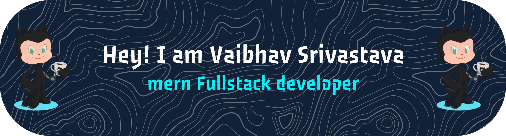

#Vaibhav-Srivatstav

# Hi 👋, I'm VAIBHAV SRIVASTAVA

### A passionate Javascript developer

<!
  
>

- Visit my work: **[https://portfolio-vaibhav-srivastava.vercel.app/](https://portfolio-vaibhav-srivastava.vercel.app/)**

<h3 align="left">Connect with me:</h3>

<h3 align="left">Languages and Tools:</h3>

                                        

<!-- Snake Game Repo View -->

  

<!-- Proudly created with GPRM ( https://gprm.itsvg.in ) -->
